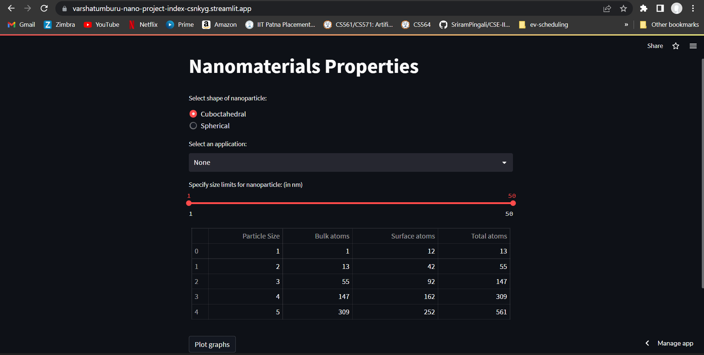
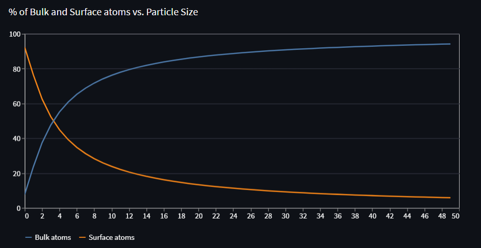
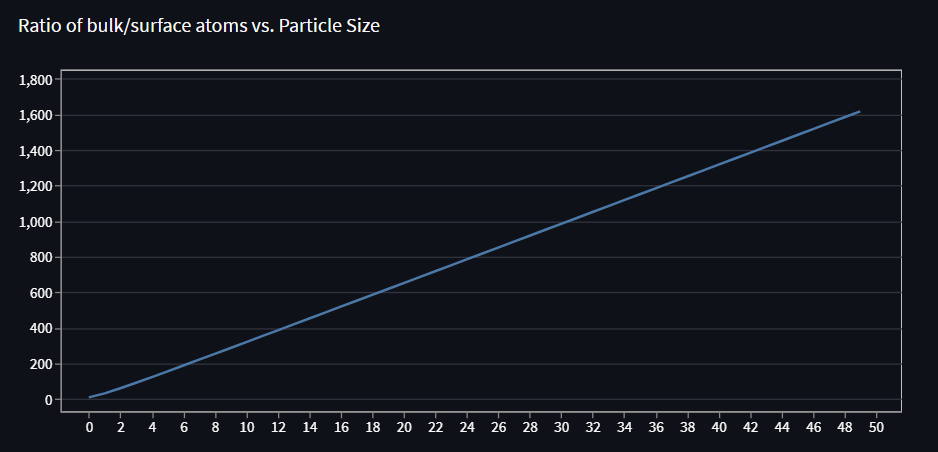

# Nano-Project

[Click here](https://varshatumburu-nano-project-index-csnkyg.streamlit.app/) to visit deployed project

## Tech Stack

* Python - Streamlit

## Question 1

Write a computer programming to deduce the total number of atoms and surface atoms for different shell of cuboctahedral/spherical shape. Plot % of atoms in bulk/surface versus particle size. The user should get idea to generate the thickness or size of nanoparticle for a particular application.(namely optical/electrical/magnetic/strength)

## Implementation

### Inputs

* Shape (Cuboctahedral/Spherical)
* Application (Optical/Electrical/Magnetic/Strength/None)
* Range of size of nanoparticle (default: 1-50 nm): Depends on user choice of application

### Output

* Table with deduced values of bulk and surface atoms for each particular layer
* Graph that plots the surface atom % and bulk atom % w.r.t. particle sizes
* Graph that shows relation between bulk/surface atom ratio w.r.t. particle sizes

### Workflow

1. Firstly, a user must choose one of the shapes (Cuboctahedral/Spherical). Cuboctahedral is given as the default option.
2. Then, the user can optionally choose one of the following applications. None is the default option in this case. This option can be used when the user wants to given in a custom range. The nanoparticle sizes are mentioned below:

| Application | Radius Range (nm) |
| ----------- | ----------------- |
| Optical     | 40-100            |
| Electrical  | 10-20             |
| Magnetic    | 1-10              |
| Strength    | 1-50              |
| None        | User Choice       |

Finally, the user can click the **Plot Graphs** button.

### Code

The code uses the following formulae:

```
1. Total Number of atoms in Cuboctahedral shape = (10k^3 + 15k^2 + 11k + 3)/3
2. Number of atoms on the surface of Cuboctahedral shape = (10k^2 + 2)
3. Total Number of atoms in Spherical shape = (10k^3 - 15k^2 + 11k - 3)/3
4. Number of atoms on the surface of Spherical shape = (10k^2 - 20k + 12)

where k is the size of nanoparticle here
```

After the user gives the inputs, the application will apply the appropriate formulae to calculate surface atoms, bulk atoms and total atoms. First 5 rows of the dataset are then displayed in a table for the viewer. 

Then we calculate the **% of surface atoms and bulk atoms** for the **specified shape** . These percentages are plotted **for all particle sizes in the size range specified**. Another graph for ratio between these atoms is also plotted. 

### Outputs

You may interact with the interface [here](https://varshatumburu-nano-project-index-csnkyg.streamlit.app/).






